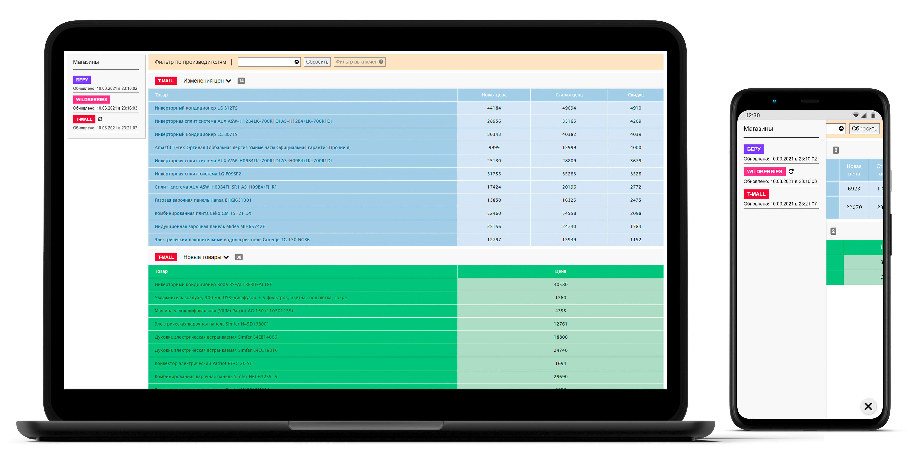

# Shops Prices App

Vue, Vue Router, SCSS, JSON Server

### To be able to run app, you need to take the following steps:

*  Clone repository

*  Open project directory in terminal and run `npm install`

*  Install [json-server](https://www.npmjs.com/package/json-server) globally `npm install -g json-server`

*  When installation completed, run `npm run serve` and `json-server database.json` in separate terminals

* Navigate to http://localhost:8080

### Additional Information:

*  The application is ready for build `npm run build` and deployment, check [this](https://github.com/firstake/shops-prices/blob/master/.env.production) and [this](https://cli.vuejs.org/guide/deployment.html)